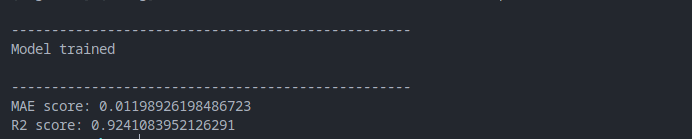

# 30 day LTV prediciton


<div id="header" align="center">
  
</div>

## <b>Introduction</b>
This is a data from one of the mobile product of Genesis company. The main task was to predict the 30 day LifeTime Value for a user based on 7 days of his interaction with the product.

During the work, an exploratory data analysis (<b>`eda.ipynb`</b>) was carried out, which revealed the Poisson nature of most user characteristics, correlations of only certain groups of features with the target, which subsequently helped reduce the dimensionality of the data and keep the model's effectiveness at a satisfactory level. Was detected mirror that over produces low valuable users. Also analyze income structure and detected only 2 significant country regions. About 60% of income flow from IOS user of this cuntries by inner purchase.

In the work (<b>`model.ipynb`</b>), we try several model and choose only one that perfome the best. We try different techniques to improve our model and get the best score while transform our target to normal distribution and split data on 5 clusters of same users and make prediction separately on each cluster. We also implement two effective dimension reduction algorytms that do not harm our perfomance significantyly, but still reduce features nubmers from 299 to 20 and 59. As our product is a mobile app we offer deep model analysis and present the way how it making decision as it very important to business like that to understand its target audience.

The final implementation of the algorithm is proposed in the file <b>`model.py`</b>. It trains a model on input data and saves the predicted values to a file.

## <b>Technologies</b>
Project is created with:
- python version: 3.9.12
- numpy version: 1.22.3
- pandas version: 1.4.2
- matplotlib version: 3.5.1
- seaborn version: 0.11.2
- scikit-learn version: 1.1.1
- yellowbrick version: 1.5
- xgboost version: 1.5.0
- lightgbm version: 3.1.1

## <b>Launch</b>
In order to use the script, train the model and make a prediction, you need to call the following console command:

```
python model.py train_path test_path answer_path
```

Where:
- train_path - path to file with training data in format .csv
- test_path - path to file with data to predict in format .csv
- answer_path - path to place where predicted data will be stored in format .csv

## <b>Example of use</b>
Out of 1.5 million instances of data, my machine could only learn about a third, producing the following results:


